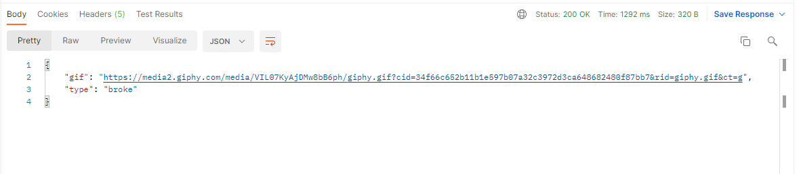

# Currency info

<h2> Что делает это приложение? </h2>

+ данное приложение позволяет узнать отношение курса к USD по сравнению с предыдущем днем
+ принимает параметр валюты для сравнения
+ отвечает json файлом с данными (ссылка с гифкой и ее тип):
  * если наша валюта стала дешевле - в этом случае тип broke
  * если наша валюта стала дороже - тип rich
  
  
<h2> Используемые сторонние сервисы</h2>

+ Для получения гиффки использовался api giphy: https://api.giphy.com/v1/gifs/
+ Для получения курса валют использовался api openexchangerates: https://openexchangerates.org/api/
  

<h2> Приложение использует </h2>
  
+ gradle
+ spring-boot-web
+ openfeign
+ wiremock
+ lombok

<h2> Запуск </h2>

1. Скачайте и установите Java11
2. Скачайте проект (git clone https://github.com/Amikuto/alpha.git)
3. Соберите проект (./gradlew build)
4. Создастся папка build. Откройте ее в терминале (cd .\build\libs\)
5. Запустите jar файл (java -jar alpha.jar)
6. Проверьте работу сервера при помощи запроса (http://localhost:8080/api/info?currency=RUB)

или

1. Скачайте и установите Java11
2. Скачайте последний релиз (https://github.com/Amikuto/alpha/releases)
3. Запустите скачанный jar файл (java -jar alpha.jar)
4. Проверьте работу сервера при помощи запроса (http://localhost:8080/api/info?currency=RUB)

<h2> Docker </h2>

1. Перейдите в папку с проектом
2. Создайте образ (docker build -t currency-service .)
3. Запустите образ (docker run -d --name currency-server -p 8080:8080 currency-service)
4. Проверьте работу сервера при помощи запроса (http://localhost:8080/api/info?currency=RUB)

<h2> Heroku </h2>

* Данный сервис был задеплоен на платформу Heroku. Достучаться до него можно по ссылочке - https://currency-app.herokuapp.com/api/info?currency=RUB

<h2> Author </h2>

Kurtaev Damir
Student of Financial University
Faculty of Information Technology and Big Data Analysis

The application is completely ready: the project is packed in  jar format. All solution methods can generate automatically generated documentation using JavaDoc.
